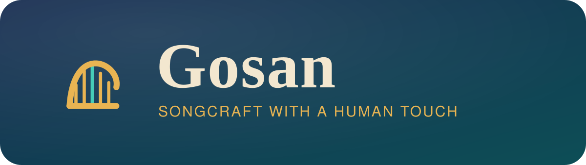
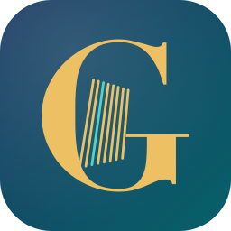

<p align="center">
  
</p>

# Gosan

A native macOS DAW (GarageBand-class) whose differentiator is a **taste engine**. Named for the
*gōsān* — the minstrel poet-musicians of Parthian and Persian folklore who carried songs by ear and
made them their own. Suno generates musical ideas, Moises/Music.ai dissects and finishes audio, and you
stay the producer. See the design:

- [`docs/VISION.md`](docs/VISION.md) — the *why/what*: philosophy, use-case catalog, taste engine.
- [`docs/SPEC.md`](docs/SPEC.md) — the *how*: native-macOS architecture, data model, API contracts, phases.

## Status

**Phase 1 — DAW bones** ✅ import audio (picker or drag-and-drop), **record from the mic** (overdub —
existing tracks play while you record, take lands at the playhead; input monitoring + level meter),
multi-track waveform timeline, synchronized AVAudioEngine playback, transport (play/stop/seek + spacebar),
per-track volume/mute/solo, zoom, **drag clips to move (beat-grid snapping), drag edges to trim, click to
select, delete clips or tracks, and bounce the mix to WAV** (offline render).

**Phase 2 — Music.ai integration** ✅. Right-click any clip → **Split into Stems**, **Analyze**
(key · BPM · chords), **Enhance** (de-reverb / denoise), **Master**, or the **Vocal Rescue** recipe
(enhance → master in one step). Jobs run async with a progress indicator; the API key is in your Keychain.

**Phase 3 — Suno generation** ✅ (first slice). **Generate** in the transport bar opens a panel: describe
a vibe → get candidates in a variant tray → audition each → add the keepers to the timeline. Uses a local
Suno session-wrapper, with **Open in Suno (manual)** (copies the prompt, opens Suno, drag the result back)
as a zero-setup fallback.

**Phase 4 — Taste Engine v1** ✅. Keeping (Add) or discarding (👎) a candidate teaches a local taste
profile. With **Use my taste** on, future prompts are silently nudged toward your strongest kept
descriptors and average tempo — and the panel shows exactly what it added ("Nudged toward: …"). Your
profile is visible as chips in the panel and resettable in Settings.

**Project save/load** ✅. File → New / Open / Save (⌘N / ⌘O / ⌘S) persist the arrangement to a `.gosan`
document (JSON; audio referenced from the library, waveforms recomputed on load).

### Music.ai setup (for the AI clip actions)

1. Get an API key from the [Music.ai](https://music.ai) developer dashboard (free tier available).
2. **Gosan → Settings (⌘,)** → paste the key.
3. Set the **workflow slugs** to match your Music.ai **Workflows** page (e.g.
   `music-ai/stems-vocals-accompaniment`). Defaults are starting points; if a job errors, check the slug.

### Suno setup (for one-click generation)

Run a local Suno API wrapper such as [`gcui-art/suno-api`](https://github.com/gcui-art/suno-api) signed in
to your own Suno account, then set its URL in **Settings → Suno** (default `http://127.0.0.1:3000`).
No sidecar? Use **Open in Suno (manual)** — it needs nothing but your Suno subscription.

## Build & run

Requires Xcode 16+ and [XcodeGen](https://github.com/yonsm/XcodeGen) (`brew install xcodegen`).
`Gosan.xcodeproj` is generated from [`project.yml`](project.yml) and is git-ignored.

```sh
make open      # generate Gosan.xcodeproj and open it in Xcode
# then press ⌘R in Xcode (pick your signing team on first run)
```

Other targets: `make generate`, `make build` (CLI compile check), `make clean`.

## Branding

The mark fuses a Persian harp (*chang*) with an equalizer — the strings *are* the audio bars.
Assets in [`branding/`](branding/); the macOS app icon is generated by
[`tools/GenerateGosanIcon.swift`](tools/GenerateGosanIcon.swift).



## Layout

```
Gosan/
  App/      GosanApp entry, palette + helpers
  Models/   AudioAsset / Clip / Track, ProjectStore, AppSettings, TasteEngine + TasteProfile
  Audio/    AudioEngine (AVAudioEngine graph), WaveformLoader, LibraryStorage, Keychain, PreviewPlayer
    AI/     MusicAIClient + JobManager (stems/analyze), SunoSidecarClient, AI/Suno types
  Views/    Editor, TransportBar, Timeline, TrackHeader, ClipLane/Waveform, Settings, GeneratePanel
  Assets.xcassets/  AppIcon
branding/   logo (SVG + PNG), wordmark lockup
tools/      GenerateGosanIcon.swift
docs/       VISION.md, SPEC.md
```
